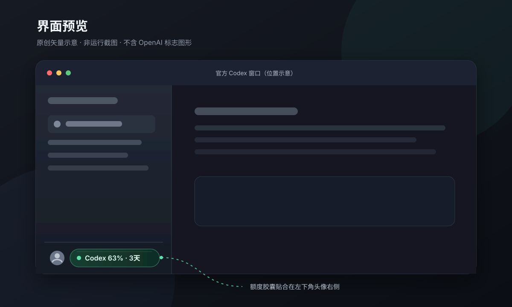

# Codex Quota

## 界面预览



这是原创矢量界面预览，用于说明额度胶囊与 Codex 窗口的相对位置，不是运行截图。

## 非 OpenAI 官方项目

Codex Quota 是社区维护的非 OpenAI 官方项目。它不会修改、替换或向官方 Codex 应用注入代码，也不使用 OpenAI 官方图标。

## 系统要求

- macOS：macOS 13 或更高版本，支持 Apple Silicon 与 Intel Mac。
- Windows：Windows 10 2004（build 19041）或更高版本，支持 x64 与 ARM64。
- 已安装包含 Codex 的官方桌面应用，并至少完成过一次会产生周额度数据的 Codex 请求；macOS 对应 Codex，Windows 对应 ChatGPT 桌面应用中的 Codex。

## 下载

从 [GitHub Releases](https://github.com/yushangrong/codex-quota/releases) 下载与系统和架构匹配的文件及对应 `.sha256`：

- macOS：`Codex-Quota-vX.Y.Z-macOS-universal.dmg`。
- Windows x64：`Codex-Quota-vX.Y.Z-Windows-x64.zip`。
- Windows ARM64：`Codex-Quota-vX.Y.Z-Windows-arm64.zip`。

macOS 打开 DMG 后，把 **Codex Quota.app** 拖入“应用程序”。Windows 解压 ZIP 后直接运行 `CodexQuota.exe`；Windows 发布包是 self-contained 单文件，不需要预装 .NET。

以 v0.2.0 为例，在下载目录先校验文件完整性：

```sh
shasum -a 256 -c Codex-Quota-v0.2.0-macOS-universal.dmg.sha256
```

看到 `Codex-Quota-v0.2.0-macOS-universal.dmg: OK` 后再打开 DMG。其他版本请把命令中的版本号替换为实际下载版本。

Windows x64 可在 PowerShell 中校验：

```powershell
$file = 'Codex-Quota-v0.2.0-Windows-x64.zip'
$expected = (Get-Content "$file.sha256").Split()[0]
$actual = (Get-FileHash -Algorithm SHA256 $file).Hash.ToLowerInvariant()
if ($actual -ne $expected) { throw 'SHA-256 校验失败' }
```

macOS 发布包采用 ad-hoc 签名，未经过 Apple 公证；Windows 发布包当前也未进行代码签名。首次启动需要按下一节操作，这些措施不是正式平台签名或公证的替代品。

## 首次打开

### macOS

1. 在“应用程序”中找到 **Codex Quota**。
2. 右键应用，选择“打开”。
3. 在 macOS 的确认对话框中再次选择“打开”。
4. 阅读权限说明，然后按需继续授权。

直接双击时，macOS 可能会阻止这个未经过 Apple 公证的版本；首次右键打开成功后，后续可以正常启动。

### Windows

1. 解压下载的 ZIP，不要直接在压缩包预览中运行。
2. 双击 `CodexQuota.exe`。
3. 如果 Microsoft Defender SmartScreen 提示未知发布者，先确认下载来源和 SHA-256，再选择“更多信息 → 仍要运行”。

Windows 版本不要求管理员权限，也不会安装系统服务。

## 辅助功能权限

辅助功能权限仅用于读取 Codex 窗口位置、大小和界面锚点，以便把额度胶囊放在窗口左下角附近。Codex Quota 不读取键盘输入、不截屏，也不需要屏幕录制权限。

如果首次没有授权，可从菜单栏选择“打开辅助功能设置”，然后在“系统设置 → 隐私与安全性 → 辅助功能”中启用 Codex Quota。

该权限只适用于 macOS。Windows 版本使用公开的 Win32 前台窗口与边界 API，不需要辅助功能或管理员权限，也不读取窗口正文。

## 使用方法

照常启动官方桌面应用并进入 Codex。目标窗口位于前台、没有最小化且侧边栏空间安全可用时，胶囊会显示在左下角头像右侧，格式类似 `Codex 63% · 3天后重置`。百分比表示剩余周额度。

移动、缩放或重新打开 Codex 窗口时，胶囊会重新贴合；切换到其他应用、最小化 Codex、能可靠检测到侧边栏收起或无法安全定位时，胶囊会隐藏。菜单栏仍可查看最近一次额度状态。

Windows 版本跟踪官方 `ChatGPT` 或 `Codex` 前台进程，并采用保守的侧边栏相对位置；切换到其他应用时会立即隐藏。Windows 客户端当前未暴露稳定的公开头像锚点，因此必要时可从系统托盘微调位置。

## 颜色说明

- 绿色：剩余额度大于 30%。
- 琥珀色：剩余额度为 10%–30%（包含边界）。
- 红色：剩余额度低于 10%。
- 灰色：当前没有可显示的有效周额度数据。

## 等待与过期状态

- `Codex -- · 等待数据`：本机文件中尚未出现有效的 Codex 周额度事件。请先完成一次 Codex 请求，然后等待下一次扫描。
- `Codex -- · 等待刷新`：已到记录的重置时间，但还没有新事件；应用不会自行假定额度恢复为 100%。
- “数据可能已过期”：最后一条有效数据超过 30 分钟没有更新。应用会保留最近值并明确标记其状态。

短窗口不会被当作周额度显示。Codex 尚未写入新事件时，界面可能继续等待，这不代表应用会自行估算用量。

## 设置

点击 macOS 菜单栏或 Windows 系统托盘中的 Codex Quota 项，可显示或隐藏悬浮层、开启或关闭开机启动、打开常驻的“调整位置”面板、选择跟随系统/深色/浅色外观、查看关于信息或退出应用。位置面板支持连续点击或按住方向按钮微调，每次移动 2 pt/px，无需反复打开菜单，并可随时恢复默认位置。macOS 菜单中还可打开辅助功能设置。开机启动默认关闭。

## 隐私

Codex Quota 只读扫描以下本机目录中的 JSONL 限额事件：

- `~/.codex/sessions`
- `~/.codex/archived_sessions`

它只解析五个字段：

| 字段 | 用途 |
| --- | --- |
| `limit_id` | 确认数据属于 Codex 限额 |
| `used_percent` | 计算剩余额度 |
| `window_minutes` | 只选择 10080 分钟的周窗口 |
| `resets_at` | 显示重置倒计时 |
| `timestamp` | 在多个事件中选择最新有效值 |

应用不读取或缓存提示词、回复正文或账号凭据。它只保存最近的最小额度快照和不含对话内容的诊断代码：

- macOS：`~/Library/Application Support/CodexQuota/snapshot.json` 与 `~/Library/Logs/CodexQuota/app.log`。
- Windows：`%LOCALAPPDATA%\CodexQuota\snapshot.json` 与 `%LOCALAPPDATA%\CodexQuota\app.log`；界面设置位于 `%APPDATA%\CodexQuota\settings.json`。

Codex Quota 不发起网络请求，不包含遥测，不监听公网端口，也不运行本地 HTTP 服务。下载 Release 是浏览器与 GitHub 之间的操作，不是应用运行时网络行为。

## 卸载

### macOS

1. 先从菜单栏关闭“开机启动”，移除登录项，然后退出 Codex Quota。
2. 从“应用程序”删除 **Codex Quota.app**。
3. 删除应用支持数据：`~/Library/Application Support/CodexQuota`。
4. 删除本地 Logs：`~/Library/Logs/CodexQuota`。
5. 如需清除设置，可删除 `~/Library/Preferences/io.github.yushangrong.codex-quota.plist`。
6. 可在“系统设置 → 隐私与安全性 → 辅助功能”中移除 Codex Quota。

### Windows

1. 先从系统托盘关闭“开机启动”，然后退出 Codex Quota。
2. 删除解压出的 `CodexQuota.exe`。
3. 如需清除缓存、日志与设置，删除 `%LOCALAPPDATA%\CodexQuota` 和 `%APPDATA%\CodexQuota`。

这些步骤不会删除或修改 `~/.codex` 中的 Codex 数据。

## 故障排查

- 看不到胶囊：确认官方 Codex 位于前台、窗口未最小化、侧边栏已展开，并检查辅助功能授权。
- 一直等待数据：完成一次 Codex 请求，等待几秒；只有 10080 分钟的 Codex 周窗口会被显示。
- 位置不准：从菜单栏打开“调整位置”面板，连续微调或恢复默认位置。
- 当前 Codex 仅暴露极简辅助功能树时，应用会采用保守的侧边栏位置回退；该模式无法区分侧边栏是否收起，收起侧边栏时可从菜单栏关闭悬浮层。
- 授权后仍无效：退出并重新打开 Codex Quota，再检查辅助功能列表中的开关。
- 诊断状态异常：查看 `~/Library/Logs/CodexQuota/app.log` 中的本地错误代码；日志不含对话正文。
- 出现 `SCAN_FAILED`：应用未能访问任何配置的数据目录，或在尚未取得有效周快照时遇到文件读取错误；检查 `~/.codex` 的存在性与本机读取权限后重试。
- Windows 看不到托盘图标：检查任务栏托盘的隐藏图标区域，并确认没有重复启动的旧进程。
- Windows 胶囊位置不准：确认前台进程是官方 `ChatGPT`/`Codex`，再从托盘菜单打开“调整位置”面板连续微调或恢复默认位置。
- Windows 使用 WSL 模式时一直等待数据：当前版本只自动扫描 Windows 原生 Codex 的 `%USERPROFILE%\.codex`；WSL 主目录中的会话尚未自动发现。
- Windows 诊断日志：查看 `%LOCALAPPDATA%\CodexQuota\app.log`；日志同样不含对话正文。

## 开发

macOS 开发需要安装包含 Swift 6 的完整 Xcode。常用检查命令：

```sh
swift test
zsh Tests/Scripts/build-scripts-test.sh
zsh Tests/Scripts/repository-policy-test.sh
```

Windows 开发需要 .NET 8 SDK，并在 Windows 10/11 上运行：

```powershell
dotnet build windows/CodexQuota.Windows/CodexQuota.Windows.csproj --configuration Release
dotnet run --project windows/CodexQuota.Windows.Tests/CodexQuota.Windows.Tests.csproj --configuration Release -- Tests/Fixtures
pwsh -File scripts/build-windows.ps1 -Version 0.2.0
```

构建 Universal DMG：

```sh
zsh scripts/build-dmg.sh 0.2.0
zsh scripts/verify-release.sh "dist/Codex Quota.app"
```

## 发布

Pull request 会分别在 `macos-15` 与 `windows-latest` 上运行 Swift 和 .NET 测试。推送符合 `v*` 的版本标签后，Release 工作流会校验版本号，构建 Universal DMG、Windows x64/ARM64 self-contained ZIP，并上传对应产物和 `.sha256` 到 GitHub Release。

macOS 产物仍是 ad-hoc 签名且未经过 Apple 公证，Windows 产物当前未代码签名。只有在两端测试和人工验收完成后才应创建正式版本标签。

## 许可证

本项目采用 [MIT License](LICENSE)。
